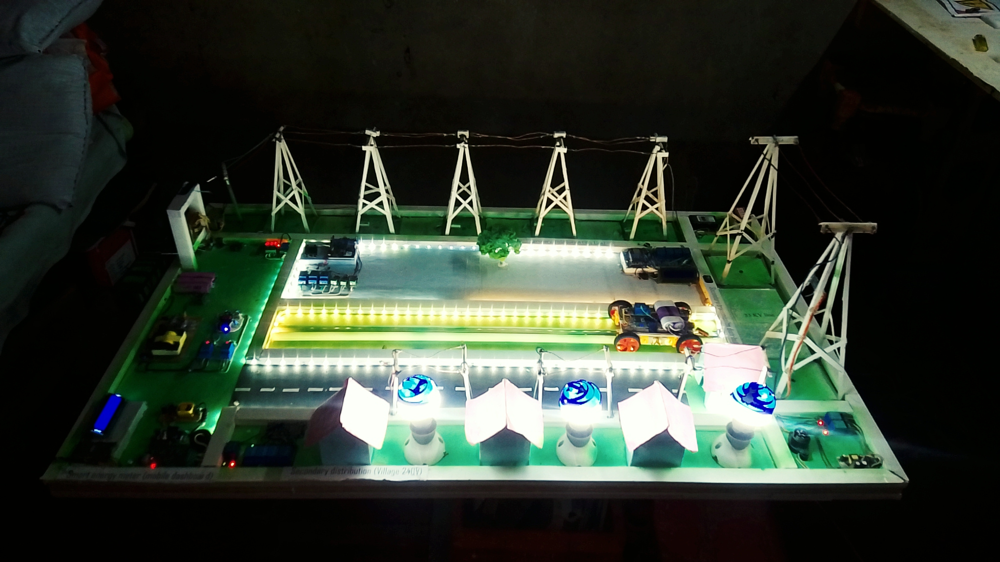
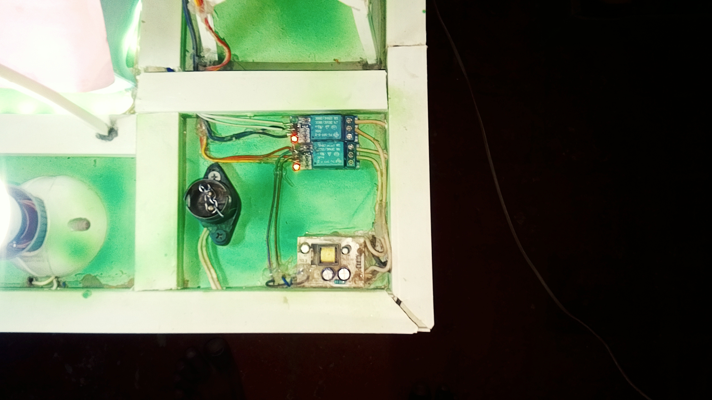
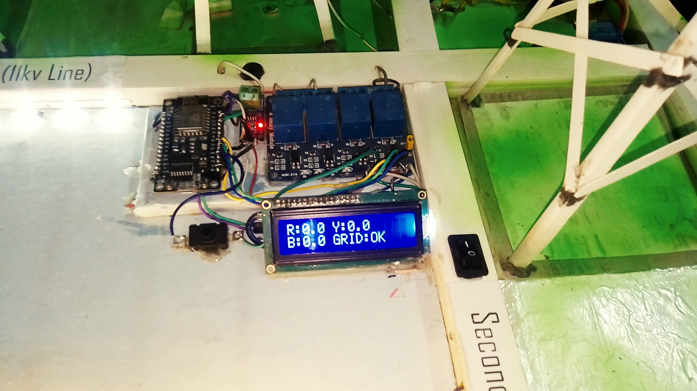
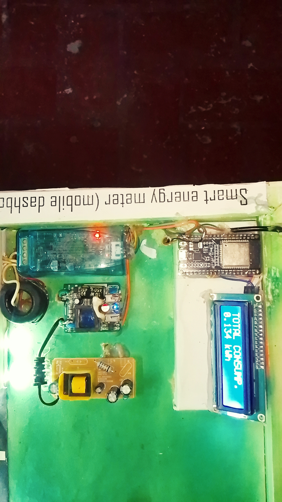
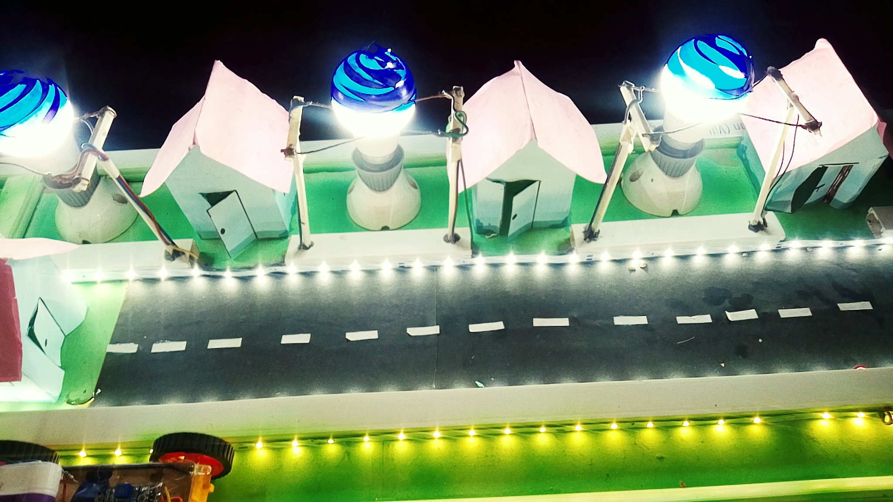
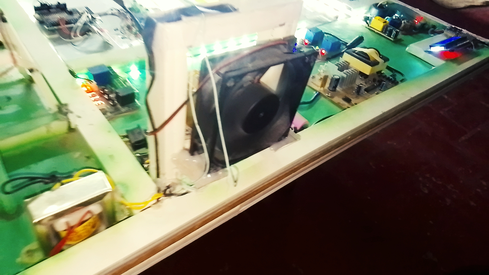
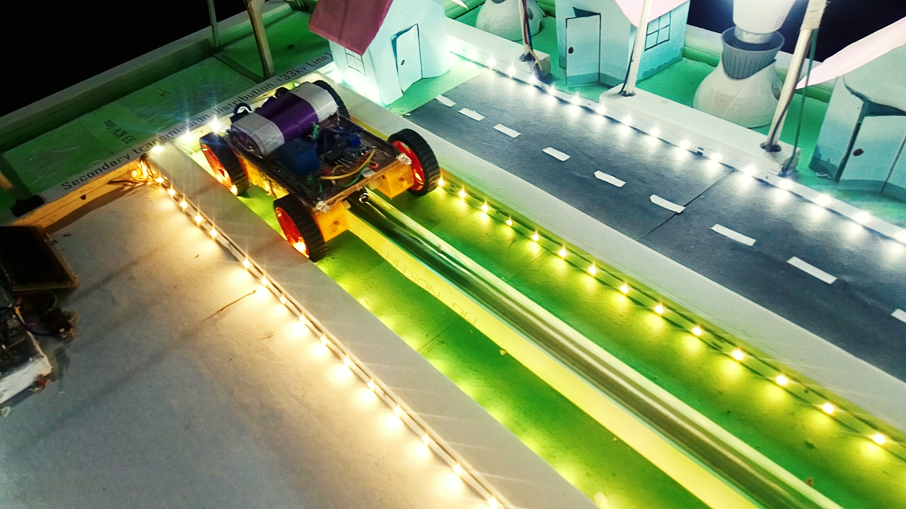
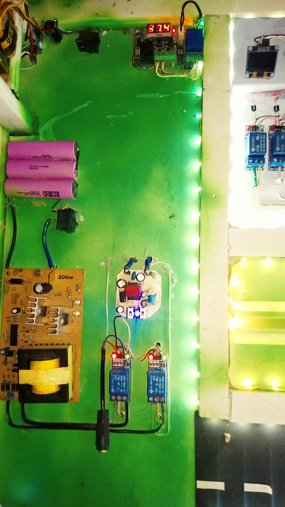
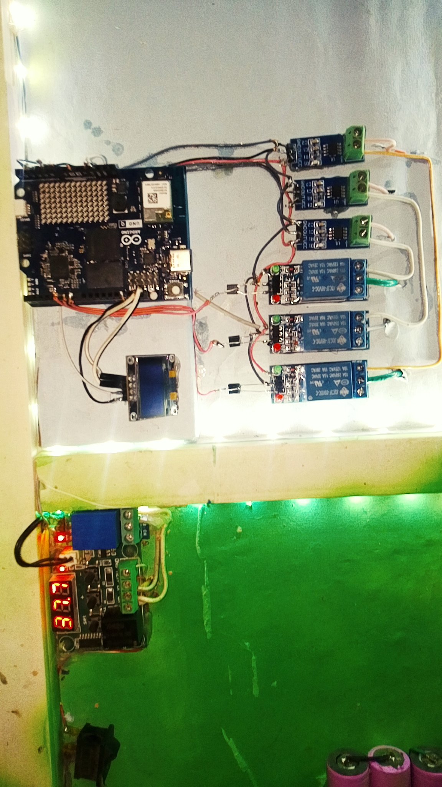

# SMART-GRID-POWER-DISTRIBUTION-MONITORING-SYSTEM

## Arduino Physical AI Challenge India 2026

Smart Grid Power Distribution & Monitoring System is an AI-driven electrical infrastructure platform developed using Arduino UNO Q, ESP8266 NodeMCU, sensors, relays, and Edge AI algorithms. The system provides real-time fault detection, fault distance estimation, transformer protection, smart metering, underground cable fault tracking, backup power automation, and intelligent grid monitoring.

---

## Competition Details

**Competition:** Arduino Physical AI Challenge India 2026

**Track:** Industrial, Smart Manufacturing & Sustainability

**Developer:** Rahul Kalwa

**Institute:** Choudhary Roopram Pvt. ITI, Rawatsar, Rajasthan, India

---
## GitHub Repository

[View GitHub Repository](https://github.com/rkproject8290-blip/SMART-GRID-POWER-DISTRIBUTION-MONITORING-SYSTEM)

---

## Project Demonstration Video

[Watch Demo Video](https://www.youtube.com/watch?v=-VYQzXCepr0)

---

## Project Overview

The project is designed to create a self-healing and intelligent power distribution network capable of:

* Real-Time Fault Detection
* Fault Distance Estimation
* Transformer Health Monitoring
* Smart Energy Metering
* Underground Cable Fault Tracking
* Street Light Fault Detection
* Automatic Backup Power Switching
* Phase Load Balancing
* Zonal Fault Isolation
* IoT-Based Monitoring

---

## Core Project Modules

### 1. 33KV Incoming Grid Fault Protection

* High-speed fault isolation
* Fire protection integration
* Relay-based emergency shutdown

### 2. Edge AI 11KV Line Fault Detection

* Real-time fault detection
* Fault distance calculation
* LCD-based diagnostics
* Phase-wise fault identification

### 3. Underground Cable Fault Detection Robot

* Wireless fault tracking
* Electromagnetic signal detection
* Fault location identification

### 4. Transformer Protection System

* Temperature monitoring
* Cooling fan automation
* Emergency shutdown protection

### 5. Backup UPS / Micro Grid System

* Automatic changeover
* Backup power supply
* Emergency grid support

### 6. Smart Street Light Monitoring

* Street light fault detection
* ESP-NOW communication
* Blynk cloud monitoring
* Remote diagnostics

### 7. Smart Grid Load Balancing

* ACS712 current monitoring
* Overload detection
* Automatic phase protection

### 8. Smart Energy Meter

* Energy monitoring
* Overload protection
* Under-voltage protection
* Over-voltage protection
* Consumer safety management

---

## Project Photos

### Complete Smart Grid Model

### 33KV Grid Fault Protection

### 11KV Fault Detection Module

### Smart Meter Module

### Street Light Monitoring Module

### Transformer Protection Module

### Underground Cable Fault Detection

### Backup UPS System

### Arduino UNO Q Overload Protection

---

## Hardware Used

* Arduino UNO Q
* ESP8266 NodeMCU
* ACS712 Current Sensor
* Relays
* LCD Display
* Temperature Sensor
* Buzzer
* Transformer
* Power Supply
* IoT Monitoring System

---

## GitHub Repository Contents

* AI_based_smart_grid_overload_protection.ino
* Edge_AI_11kv_Line_fault_detection.ino
* Edge_AI_smart_meter.ino
* Edge_AI_street_light_fault_detection.ino

---

## Future Scope

* Predictive Maintenance using AI
* Wireless Mesh Grid Monitoring
* Smart City Integration
* Cloud Analytics Dashboard
* Renewable Energy Integration

---

## License

Developed for Arduino Physical AI Challenge India 2026.

Copyright © Rahul Kalwa
